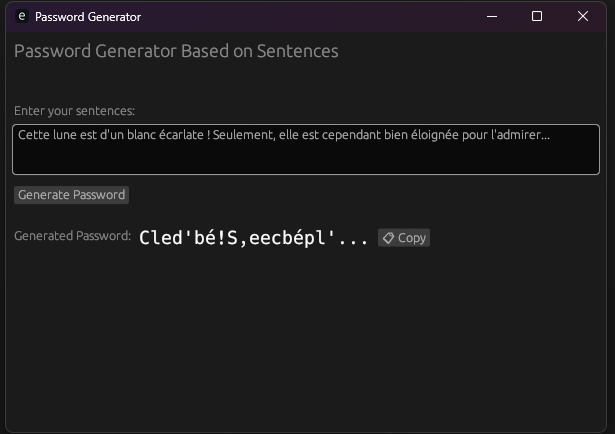

+++
title = "Générateur de mot de passe en Rust "
date = "2024-12-13T14:04:21+01:00"
#dateFormat = "2006-01-02" # This value can be configured for per-post date formatting
+++

# Un générateur de mot de passe mnémotechnique en Rust

La sécurité de nos comptes en ligne est cruciale, mais qui n'a jamais galéré à retenir un mot de passe du style "Kj9#mP2$vL" ? Aujourd'hui, je vous présente un projet qui allie sécurité et simplicité : un générateur de mot de passe basé sur des phrases, développé en Rust avec le framework egui.

## Le concept 

L'idée est simple mais efficace : au lieu de générer un mot de passe totalement aléatoire, notre application transforme une phrase de votre choix en un mot de passe robuste. Comment ? En prenant la première lettre de chaque mot et en remplaçant certains caractères par des symboles et des chiffres.

Par exemple, la phrase :
"I love to code and create security tools!"
devient :
"1l2c&c$t!"

## Les avantages de cette approche

1. **Mémorisation facilitée** : Vous n'avez qu'à vous souvenir de votre phrase, le programme s'occupe de la transformation.
2. **Personnalisation** : Choisissez une phrase qui a du sens pour vous.
3. **Sécurité maintenue** : Les substitutions de caractères et la ponctuation conservée rendent le mot de passe complexe.

## Le code : décortiquons les points clés

### La structure de données

```rust
struct PasswordGeneratorApp {
    input_text: String,
    generated_password: String,
}
```

Notre application est minimaliste : elle ne stocke que le texte d'entrée et le mot de passe généré.

### La logique de génération

Le cœur de notre application réside dans la méthode `generate_password`. Elle procède en deux étapes :

1. **Substitution des mots et caractères** :
   - Remplacement de mots complets ("and" → "&", "to" → "2", etc.)
   - Substitution de caractères ("a" → "@", "i" → "1", etc.)

2. **Extraction des premières lettres** :
   - Conservation de la ponctuation
   - Prise en compte des espaces pour identifier les nouveaux mots

### L'interface utilisateur

Grâce au framework egui, nous avons une interface graphique simple et efficace avec :
- Une zone de texte pour entrer la phrase
- Un bouton de génération
- Un affichage clair du résultat
- Un bouton de copie pour faciliter l'utilisation



## Perspectives d'amélioration

Ce projet pourrait être enrichi de plusieurs façons :
- Ajout de règles de substitution personnalisables
- Vérification de la force du mot de passe généré
- Support multilingue plus étendu
- Export/import des règles de substitution

## Conclusion

Ce générateur de mot de passe propose une approche rafraîchissante de la gestion des mots de passe. En combinant la puissance de Rust, la simplicité d'egui et une approche mnémotechnique, nous obtenons un outil pratique qui réconcilie sécurité et facilité d'utilisation.

N'hésitez pas à contribuer au projet ou à l'adapter à vos besoins. Le code source complet est disponible sur [GitHub](https://github.com/GreyRav/gen-password).
