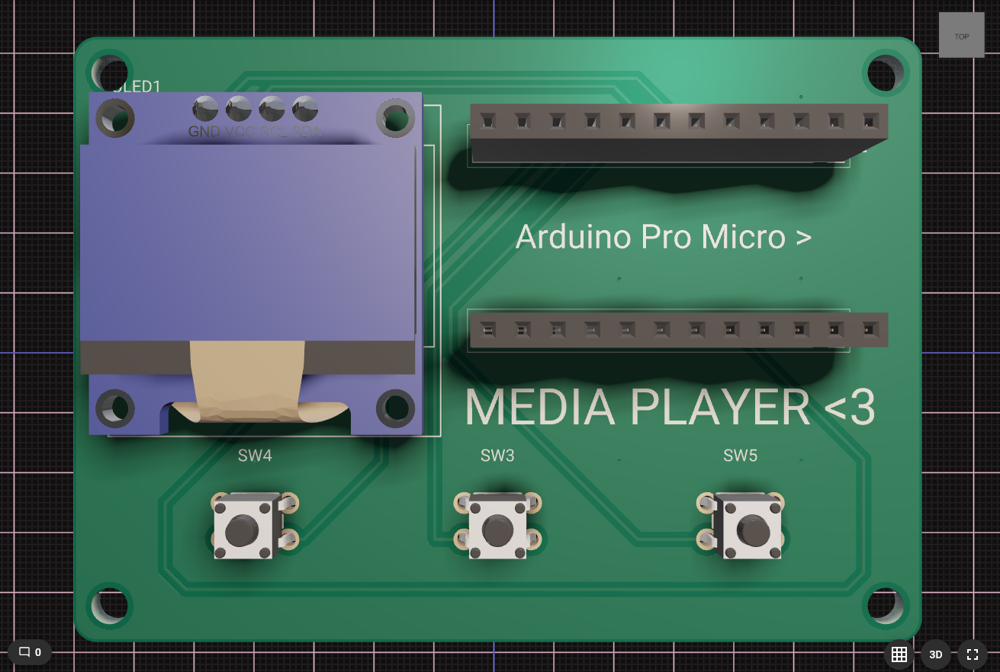
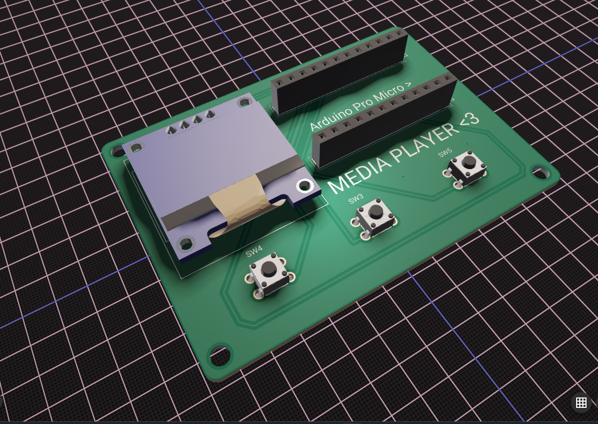

+++
date = '2024-12-12T13:51:16+01:00'
title = 'Media Player'
+++

Bonjour à tous et bienvenue sur mon blog concernant le Media Player. Le Media Player est un outil que je voulais concevoir afin de faire des projets d'apprentissage.

## Quel est son but ?

Son but est simplement de pouvoir changer de musique/vidéo, et mettre lecture/pause. On peut bien évidemment changer le code pour en faire totalement autre chose comme par exemple un mini stream deck ou autre.

## Quels sont les composants principaux ?

Les composants/matériaux principaux sont tout simplement un écran SSD1315, un Arduino pro micro, et des boutons classiques (G-Switch GT-TC075B-H100-L1).

En ce qui concerne le code ci-dessous, celui-ci est fait en C++ avec le framework IDE PlatformIO et Arduino IDE, sur VS Code :

```cpp
#include <Arduino.h>
#include <HID-Project.h>
#include <U8g2lib.h>
#include <Wire.h>

const int PREV_BTN = 5;
const int PLAY_BTN = 6;
const int NEXT_BTN = 7;

U8G2_SSD1306_128X64_NONAME_F_HW_I2C u8g2(U8G2_R0);

// Variables d'état
bool isPlaying = false;
String currentAction = "Ready";
unsigned long lastActionTime = 0;
const unsigned long ACTION_DISPLAY_TIME = 1000;

// Variables pour l'animation de la barre de progression
int progressBarPosition = 0;
const int PROGRESS_BAR_WIDTH = 120;
unsigned long lastProgressUpdate = 0;
const unsigned long PROGRESS_UPDATE_INTERVAL = 100;

// Variables pour les effets de transition
int transitionStep = 0;
bool inTransition = false;
String nextAction = "";

void setup() {
  Wire.begin();
  pinMode(PREV_BTN, INPUT_PULLUP);
  pinMode(PLAY_BTN, INPUT_PULLUP);
  pinMode(NEXT_BTN, INPUT_PULLUP);
  Consumer.begin();
  u8g2.begin();
}

void drawPlayTriangle(int x, int y, int size) {
  int height = size * 1.5;
  u8g2.drawTriangle(x, y, x + size, y + (height/2), x, y + height);
  u8g2.drawTriangle(x+1, y+1, x + size-1, y + (height/2), x+1, y + height-1);
}

void drawPauseIcon(int x, int y, int width, int height) {
  u8g2.drawBox(x, y, width, height);
  u8g2.drawBox(x + width + 4, y, width, height);
}

void drawArrow(int x, int y, int size, bool right) {
  if (right) {
    u8g2.drawLine(x, y, x + size, y + size/2);
    u8g2.drawLine(x + size, y + size/2, x, y + size);
  } else {
    u8g2.drawLine(x + size, y, x, y + size/2);
    u8g2.drawLine(x, y + size/2, x + size, y + size);
  }
}

void drawProgressBar() {
  u8g2.drawFrame(4, 25, PROGRESS_BAR_WIDTH, 6);
  if (isPlaying) {
    u8g2.drawBox(4, 25, progressBarPosition, 6);
    if (millis() - lastProgressUpdate > PROGRESS_UPDATE_INTERVAL) {
      progressBarPosition++;
      if (progressBarPosition > PROGRESS_BAR_WIDTH) progressBarPosition = 0;
      lastProgressUpdate = millis();
    }
  }
}

void drawMainScreen(bool drawText = true) {
  u8g2.clearBuffer();
  
  // Cadre principal
  u8g2.drawRFrame(0, 0, 128, 64, 2);
  u8g2.drawLine(0, 16, 128, 16);
  
  // Titre
  u8g2.setFont(u8g2_font_profont12_tr);
  u8g2.drawStr(4, 12, "Media Controller");
  
  // Barre de progression
  drawProgressBar();
  
  // Texte d'état
  if (drawText) {
    u8g2.setFont(u8g2_font_profont11_tr);
    int textWidth = u8g2.getStrWidth(currentAction.c_str());
    u8g2.drawStr((128-textWidth)/2, 40, currentAction.c_str());
  }
  
  // Contrôles
  drawArrow(20, 45, 12, false);
  if (isPlaying) {
    drawPauseIcon(58, 45, 3, 12);
  } else {
    drawPlayTriangle(58, 45, 12);
  }
  drawArrow(96, 45, 12, true);
  
  u8g2.sendBuffer();
}

void setAction(String action, bool temporary = false) {
  currentAction = action;
  if (temporary) {
    lastActionTime = millis();
  }
  drawMainScreen();
}

void loop() {
  // Gestion des boutons
  if (digitalRead(PREV_BTN) == LOW) {
    Consumer.write(MEDIA_PREVIOUS);
    setAction("Previous Track", true);
    delay(200);
    Consumer.releaseAll();
  }

  if (digitalRead(PLAY_BTN) == LOW) {
    Consumer.write(MEDIA_PLAY_PAUSE);
    isPlaying = !isPlaying;
    progressBarPosition = 0;
    setAction(isPlaying ? "Playing" : "Paused");
    delay(200);
    Consumer.releaseAll();
  }

  if (digitalRead(NEXT_BTN) == LOW) {
    Consumer.write(MEDIA_NEXT);
    setAction("Next Track", true);
    delay(200);
    Consumer.releaseAll();
  }
  
  // Retour à l'état normal après le délai pour les actions temporaires
  if (millis() - lastActionTime > ACTION_DISPLAY_TIME && 
      (currentAction == "Previous Track" || currentAction == "Next Track")) {
    setAction(isPlaying ? "Playing" : "Paused");
  }
  
  // Mise à jour normale de l'écran
  drawMainScreen();
}
```

Vous trouverez directement tout le projet sur GitHub [ICI](https://github.com/GreyRav/media-player/tree/main), avec tous les frameworks, librairies et autres.

Voici à quoi ressemble la PCB :





Si vous voulez l'acheter pour soutenir le projet ou alors vous amuser avec, vous la retrouverez sur mon site : [Open & Hack](https://openandhack.fr)

Merci d'avoir pris le temps de lire ce post !
